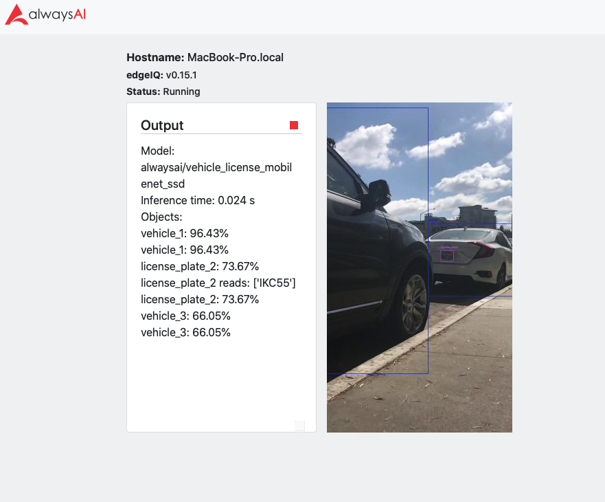
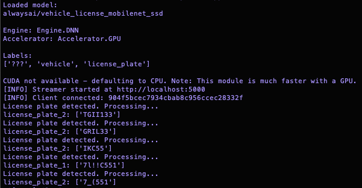

# License Plate OCR App
This app uses object detection and employs a centroid tracker to monitor a frame for license plates and vehicles and then uses an OCR library to read the license plates. This app will work on development machines, such as MacOS and Windows, but not on ARM 64 architectures due to the dependency on PyTorch. Note that we have provided the model file that EasyOCR provides at runtime to avoid model download issues. We have only provided the necessary files for the English option. If you would like to explore other uses of the EasyOCR library, please see the source: https://github.com/JaidedAI/EasyOCR/tree/393c2d966aa37160bcfdef5f55ba50daff994409. There is a link to the JaidedAI Model Hub on the repository's README.

## Requirements
- [alwaysAI account](https://alwaysai.co/auth?register=true)
- [alwaysAI CLI tools](https://dashboard.alwaysai.co/docs/getting_started/development_computer_setup.html)

## Configuration
In the requirements.txt file uncomment the packages similar to the device you are running.

## Running
For building and deploying the app, follow instructions here: https://alwaysai.co/blog/building-and-deploying-apps-on-alwaysai

## Output
Strings corresponding to the license plate values will be printed to the console as well as the text on the streamer, such as the images below

## Troubleshooting
If you are having trouble connecting to your edge device, use the CLI configure command to reset the device. Please see the following page for more details: https://alwaysai.co/docs/reference/cli_commands.html
If you encounter issues with `aai app install` please see the the configuration section to make sure you are using the correct requirements.

## Support
Docs: https://dashboard.alwaysai.co/docs/getting_started/introduction.html

Community Discord: https://discord.gg/rjDdRPT

Email: support@alwaysai.co